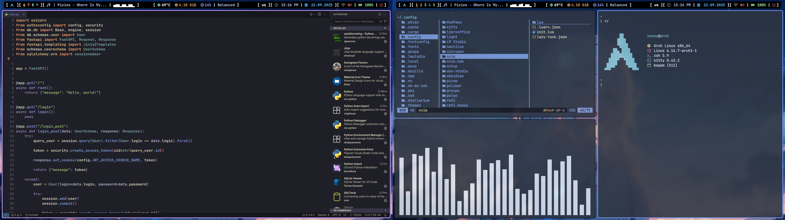
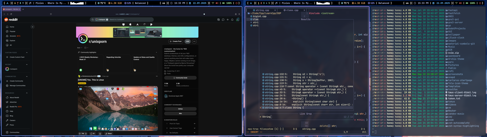
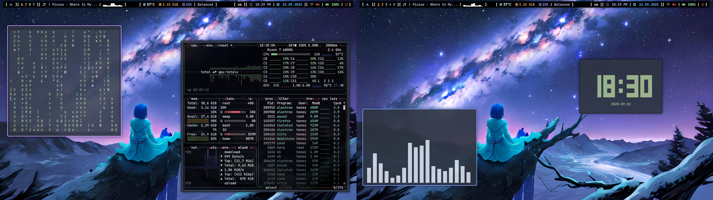

<h1 align="left"> :blue_book: About</h1> 

This is my BSPWM dotfiles 

 

 - OS: [**`Arch Linux`**](https://archlinux.org/)
 - WM: [**`BSPWM`**](https://github.com/baskerville/bspwm)
 - Bar: [**`Polybar`**](https://github.com/polybar/polybar)
 - Compositor: [**`Picom`**](https://github.com/yshui/picom)
 - Terminal: [**`Kitty`**](https://github.com/kovidgoyal/kitty)
 - App Launcher: [**`Rofi`**](https://github.com/davatorium/rofi)
 - Notify Daemon: [**`Dunst`**](https://github.com/dunst-project/dunst)
 - Shell: [**`Zsh`**](https://github.com/zsh-users/zsh)
 - Editor: [**`Nvim`**](https://github.com/neovim/neovim)

 

## 🖼️ Gallery

## 🚀 Features
* Customizing software on the system.
* Convenient custom configuration of Firefox.
* Hotkeys for maximum productivity.
* A very lightweight system that consumes less than 1Gb of memory.
